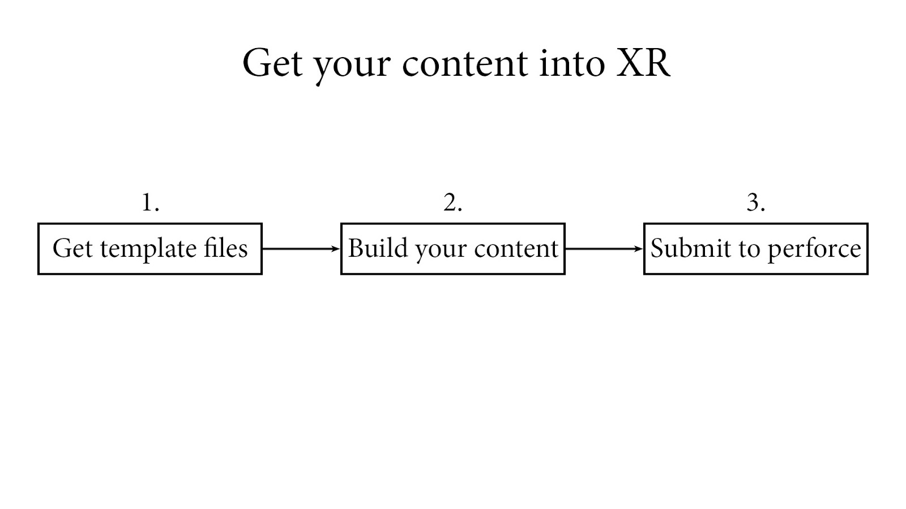

# XR Studios
Welcome to the XR Studios Content Integration Portal!

This site serves as a hub for all public resources and guides for working with XR Studios.  

](pee.md)

&nbsp;

## XR Stage and Studio Info
Want to know more details about the physical space, like the studio's address or the camera specifications?  
Check out the [Studio](docs/stage/sunset/studioInfo.md) page for Studio and Stage info.

## Content Guidelines & Resource Files
Are you preparing for a shoot with XRS and need to prepare your content?  
First get set up to send and receive content by following the [Content Delivery via Perforce](docs/content/perforce.md) guide, then refer to either the [Unreal XR Content](docs/content/unreal.md) or the [Notch XR Content](docs/content/notch.md) guides below for specific workflows and resources.

&nbsp;

&nbsp;

&nbsp;

Any questions? Reach out to *integration@xrstudios.live*