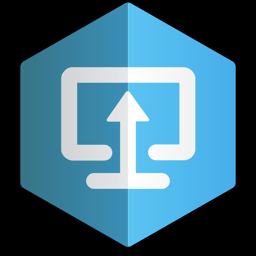
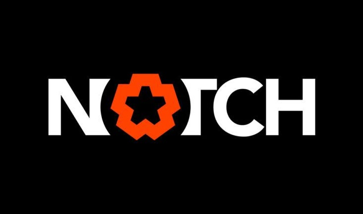

# XR Studios {docsify-ignore-all}

Welcome to the XR Studios Content Integration Portal!

This site serves as a hub for all public resources and guides for working with XR Studios.

## XR Stage and Studio Info

Want to know more details about the physical space, like the studio's address or the camera specifications?  
Check out the [Studio](docs/stage/sunset/studioInfo.md) page for Studio and Stage info.

&nbsp;

&nbsp;

&nbsp;

# XR Show Content <!-- {docsify-ignore} -->

&nbsp;

&nbsp;

## Template Files

<a href="https://xr-studios.github.io/#/docs/content/templates"><button type="button">Template Files for each supported software</button></a>

&nbsp;

## Content Guidelines & Resources

Are you preparing for a shoot with XRS and need to prepare your content?  
First get set up to send and receive content by following the [Content Delivery via Perforce](docs/content/perforce.md) guide,  
then refer to either the [Unreal](docs/content/unreal.md) or [Notch](docs/content/notch.md) XR Content Guides below for specific workflows and resources.

&nbsp;

&nbsp;

&nbsp;

Any questions? Reach out to *cts@xrstudios.live*
