# Components
Components are the individual UI elements that make up your application.

They are divided into three types: ``Controls``, ``Monitors``, and ``Organizers``

## Controls
Controls are components that are interactable, and are hooked up to control some aspect of the stage or show.
What follows is a list of controls that are implemented as part of the ofxXRS library:

The following is a list of controls built into the panel system, meaning they can be instantiated and placed individually, but **ofxXRSPanel** and **ofxXRSFolder** natively support managing and adding these components.
- Button
- Slider
- Toggle
- Color Picker
- Text Input
- Dropdown
- Button Matrix
- 2D Coordinate Pad

The following is a list of controls that are not natively supported by Panels. This means these controls are just given an x and y for their position and a width and a height for their size, and must be manually moved and/or resized whenever the window is resized.
- Knob
- Large Button
- Large Image Button

### Button
>Class: `ofxXRSButton`

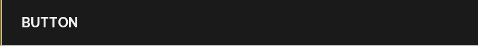

Fires a trigger, listener, or some other event when clicked.
### Toggle
>Class: `ofxXRSToggle`

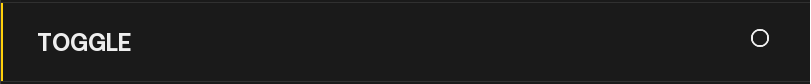

A special type of button that keeps its state when pressed - used to toggle the state of something between "enabled" or "disabled", or set a variable to either 1 or 0, etc.
### Text Input
>Class: `ofxXRSTextInput`

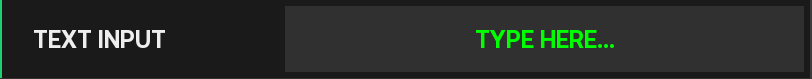

A text box where the user can input a string.
### Slider
>Class: `ofxXRSSlider`

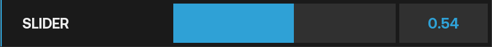

A control that sets the value of something between a minimum and maximum range.
### Color Picker
>Class: `ofxXRSColorPicker`

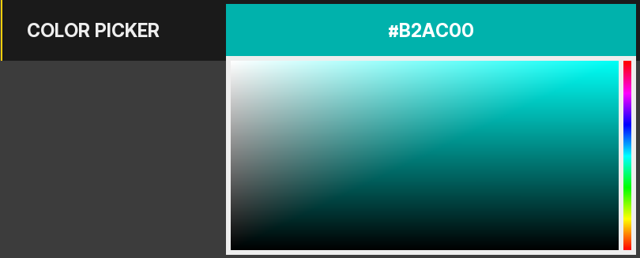

A control that drops down to a color wheel when clicked which sets the color of something using **ofColor**
### Dropdown
>Class: `ofxXRSDropdown`

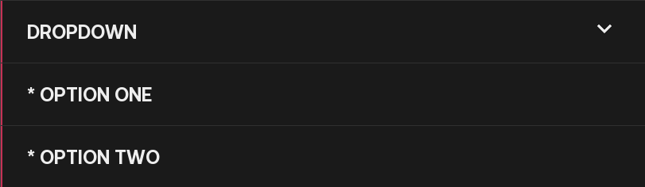

A control that drops down to a list of selections from which the user selects a single option
### Button Matrix
>Class: `ofxXRSMatrix`

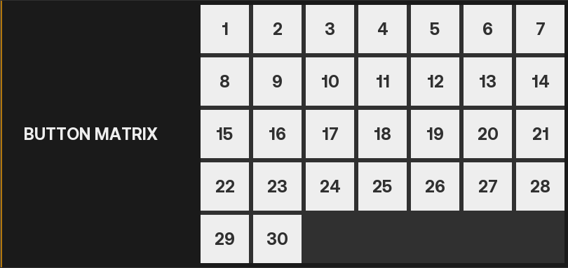

A control that allows the user to toggle one or several buttons in a grid; most often used for cue lists.
### 2D Coordinate Pad
>Class: `ofxXRS2dPad`

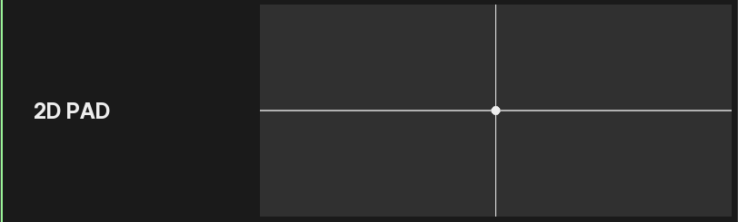

A control that allows the user to see and set the 2D Position (X, Y) of whatever aspect of the stage or show is hooked up to it.
### Knob
> Class: `TODO`

Like a slider but visualized as a circle rather than a rectangle.
### Large Button
>Class: `ofxXRSSimpleButton`

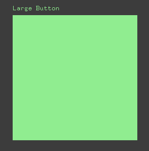

Works exactly like a button but is free-standing and can be given custom dimensions. Can be either rectangular or circular, set via an **ofxXRSSimpleButton::BUTTON_SHAPE** passed during instantiation or to the *setShape()* function.
### Large Image Button
>Class: `ofxXRSSimpleButton`

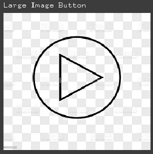

Works exactly like a Large Button but the sprite will be an image given during instantiation rather than a circle or rectangle. 

!> Note that the button will appear *exactly* as its source image; there will be no border, cropping, resizing, or blending.

&nbsp;

## Monitors
Monitors are components that listen to and report the status of some aspect of the stage or show.

The following is a list of monitors built into the panel system, meaning they can be instantiated and placed individually, but **ofxXRSPanel** and **ofxXRSFolder** natively support managing and adding these components.
- Label
- Wave Monitor
- Value Plotter

### Label
>Class: `ofxXRSLabel`

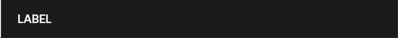

Simply displays a string of text. The alignment of the text can be set via an **ofxXRSAlignment** passed to the *setLabelAlignment()* function
### Wave Monitor
>Class: `ofxXRSWaveMonitor`

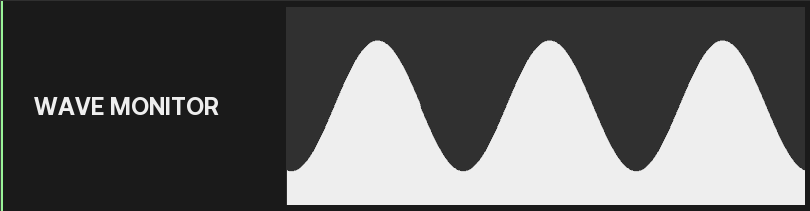

Smoothly oscillates between a negative and positive **amplitude** at a speed of **frequency** waves per second.  
Not sure why anyone would use this.
### Value Plotter
>Class: `ofxXRSValuePlotter`

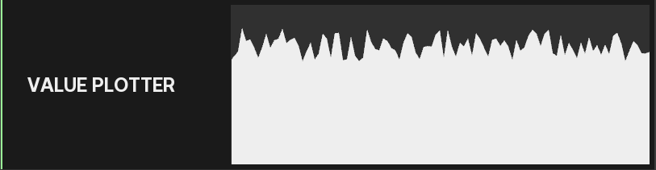

Charts a given **value** between a set **min** and **max** over time. Useful for performance and confidence monitors.

&nbsp;

## Organizers
Organizers serve no functional purpose - they are used, as the name implies, to organize your application's monitors and controls. 

!> Headers, footers, and folders work ***exclusively*** with Panels. Do not try to put a Large Button in a Folder.

### Panel
> Class: `ofxXRSPanel`

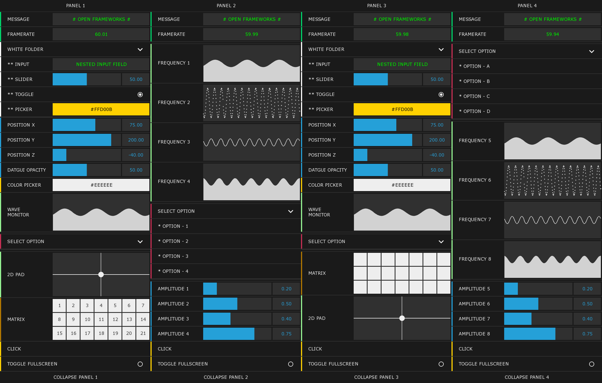

Groups together multiple components into an on-screen panel. Constructor takes two floats for the panel's X,Y coordinates or an **ofxXRSPanelAnchor**

!> Using X,Y coordinates calculated via the application window's width and height is recommended over using an **ofxXRSPanelAnchor** - they do not play nice with resizing windows.

### Header
>Class: `ofxXRSHeader`

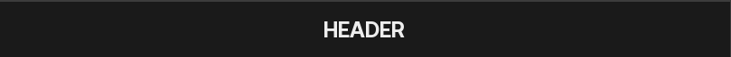

A special label for a panel that automatically places itself at the top of the panel and allows the panel to be repositioned

### Footer
>Class: `ofxXRSFooter`

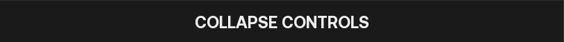

A special label for a panel that automatically places itself at the bottom of the panel and allows the panel to be resized

### Folder
>Class: `ofxXRSFolder`

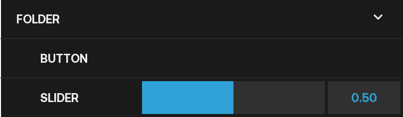

Groups together multiple components within a panel into a labeled, collapsable folder view.

### Scroll View
>Class: `ofxXRSScrollView`

Similar to a folder, except instead of expanding to show its children via a dropdown, it is a fixed size and the user can scroll through the options when mousing over the component.