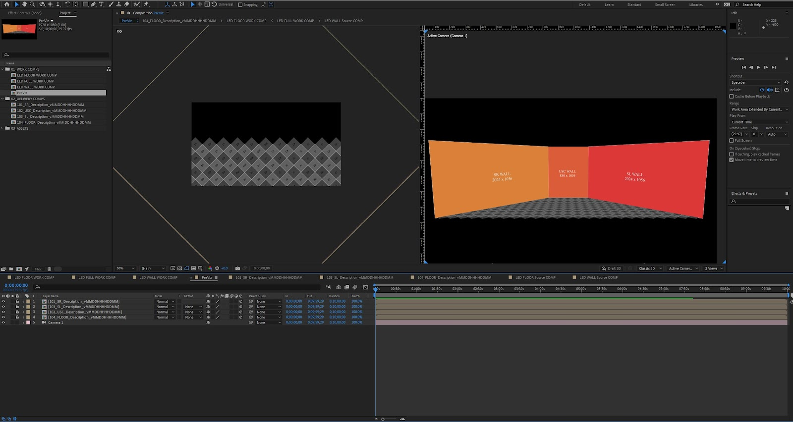

# After Effects XR Content Guide

## Getting the AE Template Files
<a href="https://drive.google.com/drive/folders/1sZy3VMLCT0cLxHtEgEtLGc2dv4hG3i5q?usp=sharing"><button type="button">Download AE Template</button></a>

## Inside the Template File

### Description
* There will be Working Comps for each section of the XR stage with Pixel dimensions. These are then linked to Delivery Comps that are to be exported as individual files for each wall segment.
* There will be "PreViz" Comp that gives a 3D preview of how the combined content will appear on the stage.
* Included in the Template Folder is an example output. Use this as an example of proper file nomenclature. 

### Gotchas
* The floor may provide some confusion as one develops. Make sure to double check the Previz comp often for accurate feedback
* Work on "LED FULL WORK COMP" to map content onto the walls and floors together.