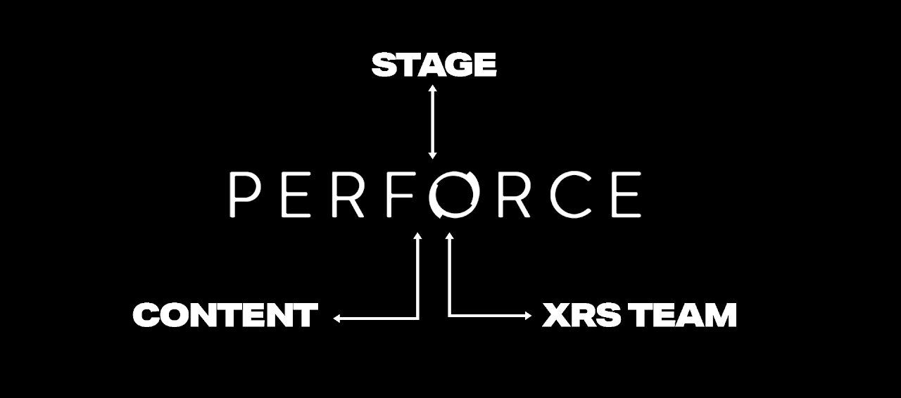
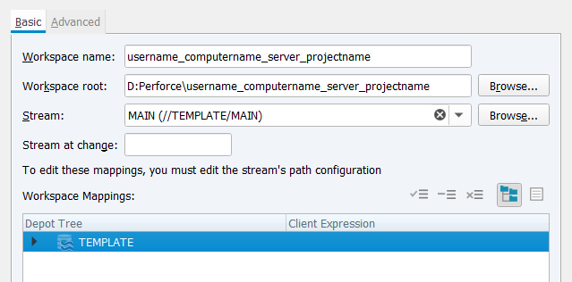
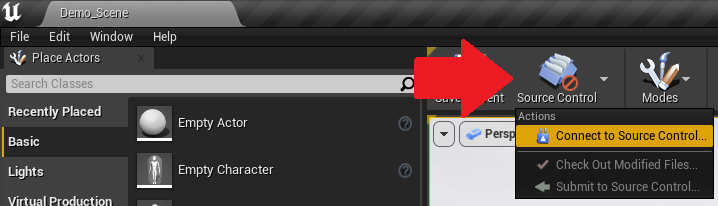

# Content Delivery via Perforce

XR Studios uses **Perforce** for content delivery and version control. Perforce provides a single solution for sharing large files, backups, maintenance, and collaboration with XR Studios.  
It replaces the need to manually send many large, complex files back and forth via email or link sharing, and acts as a method for both XR Studios and external partners to work on project files simultaneously. Additionally, Perforce allows for "versioning" of files and file history (similar to tools like Git), allowing for us to rollback changes if necessary.

The typical workflow for Perforce is as follows:

1. Install Perforce and connect to your project depot on the XR Studios Perforce server using the supplied credentials.
2. Download the template scene files via Perforce.
3. Create content and periodically submit updates via Perforce.

The steps for getting started are outlined below.

## 1: Download and Install Helix Visual Client (P4V)

From Perforce's website, download [Helix Visual Client (P4V)](https://www.perforce.com/downloads/helix-visual-client-p4v), then follow the default instructions provided by the installer.

?> If you are comfortable using a terminal, you can also use the [command-line interface (P4)](https://www.perforce.com/downloads/helix-command-line-client-p4) to do your work. However, P4V tends to be a bit easier to work with, so we recommend using that.

## 2: Connect to the Depot

Once P4V has been installed, launch it and you will be greeted by the above window. From here, you will need to input the following information:

-   **Server:** This should always be _ssl:perforce.xrstudios.live:1666_
-   **User:** This should be the username provided to you by XR Studios, typically along the lines of _{project-name}-collab-user-{number}_ (for example, _cheese-collab-user-1_).
-   **Workspace:** Leave this blank when initially logging in; once you create a workspace you can optionally populate this when logging in to switch to a given workspace immediately.

Once this done, hit "Ok". You may get a message about trusting the connection; click "Trust this connection". From here, you will be asked to input the password given to you by XR Studios. Once entered, you will be connected to the server, and should see something like this:

...with a view of your depots on the left (which should only be one, named after the project name) and your files/pending changes on the right. If you open up the project depot using the arrows, you should see a **dev** folder containing our Unreal Engine 5.1 Template.

If the username or password do not work, or you don't see the template anywhere, reach out to *cts@xrstudios.live* and will help you get things figured out!

## 3: Create a New Workspace

4. _Workspace:_ This is a dedicated location on your local machine which will contain all the project files whilst developing content. After entering your server address and user, click New Workspace.
5. _Workspace Name:_ The XRS preferred Workspace name structure is _username_computername_server_projectname_ . If this heavily conflicts with the way you name your projects, you may disregard. Please just choose something that makes sense.
6. _Workspace Root:_ Is the filepath where you will be working on local files before submitting them. The example below shows a local Workspace mapped to the D drive, but you can put your Workspace anywhere you'd like. Ensure you choose a directory with enough storage to facilitate the project.
7. _Stream:_ This is a path to referencing files in our server network. Click Browse and select the `MAIN` stream. If you are downloading just the Template from the template server, select the `TEMPLATE` stream.
8. Leave the rest of the settings as default, and click OK.

](https://xr-studios.github.io/img/p4v/p4v_workspace.PNG)

## 4: Syncing the Template Files to your Workspace

Now that you are successfully connected and have a local Workspace - you are ready to download the template files for you to begin creating content.

Click _Get Latest_ from the shelf, or by right-clicking your workspace folder and selecting _Get Latest Revision_, then wait for the files to finish syncing.

## 4: Create your Content

You now have a local copy of the template files, to begin working from.  
You can open the template from your local workspace folder.

Either navigate to it's directory, or find them directly in Perforce in the workspace tab.

!> When saving files, do not alter the directory from their current location!

Depending on the type of project file supplied, please read through the relevant information about the working with the template scene files:

-   [Unreal Engine](docs/content/unreal.md)
-   [Notch](docs/content/notch)

## 5: Connect Unreal to Source Control

If you are not using Unreal Engine, or are making changes to files unrelated to Unreal Engine, skip this step.

With P4V open and connected to the XR Studios perforce server, launch the Unreal project from your Workspace directory.

Select the source control option in Unreal and click _Connect to source control_. This option is located in different places depending on whether you are working in UE4 or UE5:

### UE4 Location

Top left next to the "Save Current" icon

### UE5 Location

Bottom right corner

In the dialog box that appears, select Perforce as your provider, then sign in using the same credentials that you are using for P4V. After filling in server and user name, you should be able to select your current workspace from the available workspaces tab (P4V must be running and connected to the server).

Click "Accept Settings".
Your engine and project are now connected to source control.

Any changes you make to the file will now ask for you to check out the modified content. _Checking out a file means that you are the only person you can edit it while it is checked out, and any changes made will be pushed to the Depot when the asset is checked in. Please be advised that if you have a file checked out, no one else will be able to work on it until you finalize and Commit your changes._

It is good practice to check out a Level before working on it, and to check out only the assets that you need.
Adding a new asset while connected to source control will automatically mark the asset for Add in your next submission.

> While connected to source control, you gain additional options when right clicking assets in the content browser. Items may be Refreshed, Synced, Checked Out, Submitted, and Reverted, among other options.

?> If an asset has a yellow question mark or exclamation point, it is out of sync with the Depot; you may need to refresh and sync the asset.

## 6: Submit your Content

You should submit updates regularly throughout your content creation process. It's good practice to get into the habit of submitting updates after completing small milestones, often multiple times per day.

The reason for submitting work after completing small milestones is that you can comment on the Changelist what work has been done. Therefore if there are any issues or errors it's very easy to undo (Revert) these changes with minimal impact to the rest of the project. Each submission you make also acts as a backup, and you can return to it at any time.

To submit your content, you will need to add your changes to a Changelist (if they have not already been added automatically by Unreal Engine). You can do this by right clicking in your Workspace tab in P4V and selecting “Mark for Add”. Assets may already be Marked for Add. You can check what you are about to submit by checking the Changelog under “Pending”. (If you do not see this option in P4V, go to View > Pending Changelists). You can expand your Pending Changelog to show all assets that will be submitted. Use this as a tool to confirm you are submitting the correct assets.

A dialog box will appear asking you what Changelist you’d like to add your assets to. You can leave this option set to Default, and then press Okay.

From the banner at the top of P4V, click Submit. This will submit your Pending Changelog, and all of the changes contained within, to the Depot.

A dialog box will appear asking you to provide a comment to describe the changes you are submitting. Please provide a helpful description of your changes so that others can quickly see what you have changed without needing to look at the logs. In this dialog you can also see all of the assets that you are submitting. Verify the list of assets contains what you expect.  
Press Submit.

## Further Reading

Perforce recently launched its own learning platform called [Perforce U](https://perforceu.perforce.com/vp/merging-collaborating-unreal-engine). You can enroll in a free, self-paced course if you would like a more in-depth tutorial.
