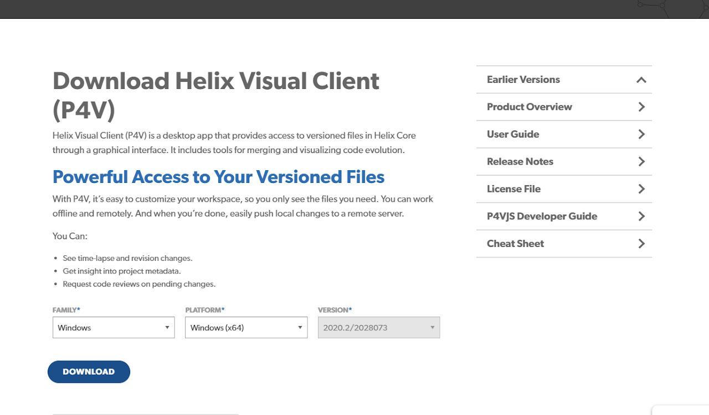
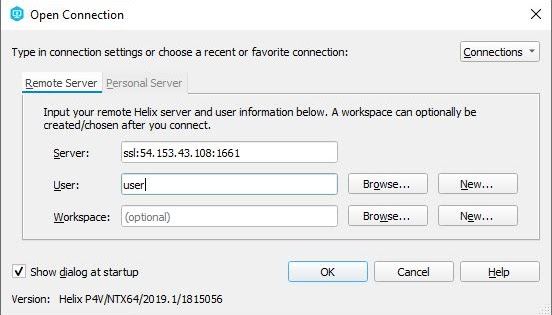
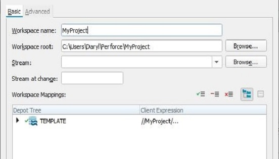
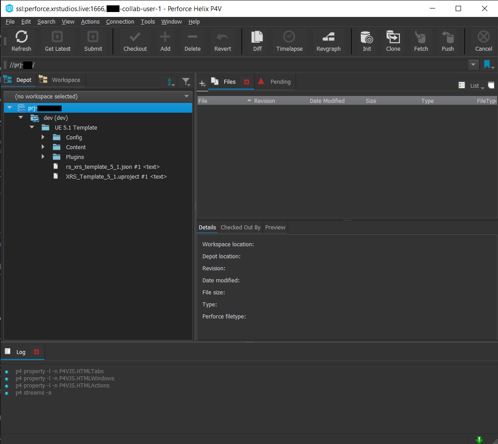

# Content Delivery via Perforce

Content is delivered and managed through Perforce.  
Perforce provides a single solution for filesharing, backups, maintenance, and collaboration with XR Studios.  
It replaces the need to manually send multiple files back and forth via email, and acts as a method for both XR Studios and external partners to work on project files simultaneously.

A typical workflow involves:
1. Installing perforce and connecting to XR Studios using the supplied credentials.
2. Download the template scene files via perforce.
3. Create content and periodically submit updates via perforce.

The steps for getting started are outlined below.

## 1: Download and Install Perforce P4V

Download the Perforce Visual Client: https://www.perforce.com/downloads/helix-visual-client-p4v

Follow the default installation steps provided by the installer.

## 2: Launch and Create a Workspace

1. Launch P4V. First we must connect to the XR Studios perforce server, and download the template files to your workspace. (Contact us if you do not have these credentials)
2. *Server:* Enter the server name provided by XR Studios. (There are multiple perforce servers)
3. *User:* Your supplied username provided by XR Studios.
4. *Workspace:* This is a dedicated location on your local machine which will contain all the project files whilst developing content. After entering your server address and user, click New workspace.
5. *Workspace Name:* This can be any name that makes sense to you. It's helpful when working on multiple projects to have a clearly identifiable name for the project, but its not important what you call it.
6. *Workspace Root:* Is the filepath where you will be working on local files before submitting them. Ensure you choose a directory with enough storage to facilitate the project.
7. *Stream:* This is a path to referencing files in our server network. Click Browse and select the MAIN stream. There might be multiple streams on different servers, if that is the case, select the stream 	matching the depot you need to access.
8. Leave the rest of the settings as default, and click OK.

## 3: Syncing the Template Files to your Workspace

Now that you are successfully connected and have a local workspace - you are ready to download the template files for you to begin creating content. 

Click *Get Latest* from the shelf, or by right-clicking your workspace folder and selecting *Get Latest Revision*, then wait for the files to finish syncing.

## 4: Create your Content

You now have a local copy of the template files, to begin working from.  
You can open the template from your local workspace folder.

Either navigate to it's directory, or find them directly in perforce in the workspace tab.  

!> When saving files, do not alter the directory from their current location.

Depending on the type of project file supplied, please read through the relevant information about the working with the template scene files:
- [Unreal Engine](docs/content/unreal.md)
- [Notch](docs/content/notch)

## 5: Connect Unreal to Source Control

If you are not using Unreal Engine, or making changes to files unrelated to Unreal Engine, skip this step.  
With P4V open, and connected to the XRStudios perforce server, launch the Unreal project from your workspace directory.

Along the top banner within Unreal, select the source control option next to “save current”, click *Connect to source control*

In the dialog box that appears, select perforce as your provider, then sign in using the same credentials that you are using for P4V. After filling in server and user name, you should be able to select your current workspace from the available workspaces tab (P4V must be running and connected to the server).

Hit Accept Settings.  
Your engine and project are now connected to source control.

Any changed you make to the file will now ask for you to check out the modified content. Checking out a file means that you are the only person you can edit it while it is checked out, and any changes made will be pushed to the depot when the asset is checked in.

It is good practice to check out a level before working on it, and to check out only the assets that you need.
Adding a new asset while connected to source control will automatically mark the asset to be added in your next submission.

> While connected to source control, you gain additional options when right clicking assets in the content browser. Items may be refreshed, synced, checked out,  submitted, and reverted among other options.

> If an asset has a yellow question mark or exclamation point, it is out of sync with the depot, you may need to refresh and sync the asset.

## 6: Submit your Content
You should submit updates regularly throughout your content creation process. It's good practice to get into the habit of submitting updates after completing small milestones, often multiple times per-day.

The reason for submitting work after completing small milestones, is that you can comment on the changelist what work has been done. Therefore if there are any issues or errors it's very easy to undo (revert) these changes with minimal impact to the rest of the project. Each submission you make also acts as a backup with which you can return to at any point in time.

To submit your content, you will need to add your changes to a changelist (if they have not already been added by Unreal Engine). You can do this by right clicking in your workspace tab in P4V and selecting “mark for add”. Assets may already be marked for add. You can check what you are about to submit by checking the changelog under “pending”. You can expand your pending changelog to show all assets that will be submitted. Use this as a tool to confirm you are submitting the correct assets.

A dialog box will appear asking you what changelist you’d like to add your assets to. You can leave this option set to default and then press okay.

From the banner at the top of P4V, click submit. This will submit your pending changelog, and all of the changes contained within, to the depot.

A dialog box will appear asking you to provide a comment to describe the changes you are submitting. Please provide a helpful description of your changes so that others can quickly see what you have changed without needing to look at the logs. In this dialog you can also see all of the assets that you are submitting. Verify the list of assets contains what you expect.  
Press Submit.