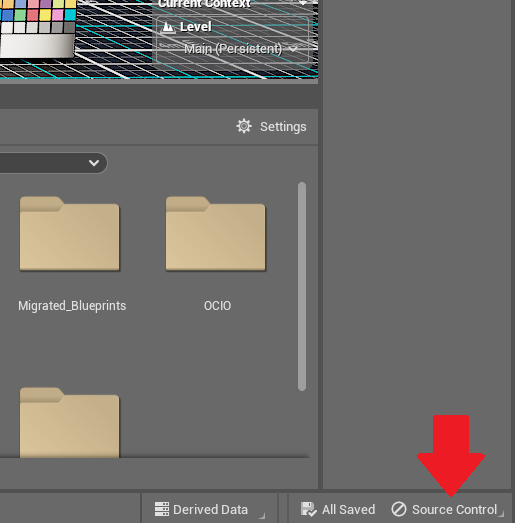

# Using Perforce For Content Delivery and Version Control

XR Studios uses **Perforce** for Unreal Engine content delivery and version control. Perforce provides a single solution for sharing large files, backups, maintenance, and collaboration with XR Studios. It replaces the need to manually send many large, complex files back and forth via email or link sharing, and acts as a method for both XR Studios and external partners to work on project files simultaneously. Additionally, Perforce allows for "versioning" of files and file history (similar to tools like Git), allowing for us to rollback changes if necessary.

The steps for integrating your project with Perforce are outlined below:

## 1: Download and Install Perforce

To utilize Perforce, you will need to download **Helix Visual Client** (or **P4V**), which is the visual interface for using Perforce. You can download [Helix Visual Client (P4V)](https://www.perforce.com/downloads/helix-visual-client-p4v) from Perforce's website.

?> For Windows users, we recommend installing via the EXE installer over the MSI installer.

When you run the P4 installer, you should see the following screen, asking which apps to download. You should only need Helix Visual Client (P4V) and no other apps, so uncheck everything else. From here, installation should finish.

?> If you are comfortable using a terminal, you can also use the [command-line interface (P4)](https://www.perforce.com/downloads/helix-command-line-client-p4) for tracking your work. However, P4V tends to be easier to use, so we recommend using that.

## 2: Connect to the Depot

Once P4V has been installed, launch it and you will be greeted by the above window. From here, you will need to input the following information:

-   **Server:** This should always be _ssl:perforce.xrstudios.live:1666_
-   **User:** This should be the username provided to you by XR Studios, typically along the lines of _{project-name}-collab-user-{number}_ (for example, _cheese-collab-user-1_).
-   **Workspace:** Leave this blank when initially logging in; once you create a workspace you can optionally populate this when logging in to switch to a given workspace immediately.

Once this done, hit "Ok". You may get a message about trusting the connection; click "Trust this connection". From here, you will be asked to input the password given to you by XR Studios. Once entered, you will be connected to the server, and should see something like this:

...with a view of your depots on the left (which should only be one, named after the project name) and your files/pending changes on the right. If you open up the project depot using the arrows, you should see a **dev** folder containing our Unreal Engine 5.1 Template.

If the username or password do not work, or you don't see the template anywhere, reach out to *cts@xrstudios.live* and will help you get things figured out!

## 3: Create a New Workspace

To be able to pull down our template and begin making edits, you need to create a **workspace** in P4V. On the left side of the screen, right beside the _"Depots"_ tab, you'll see a _"Workspaces"_ tab - click on that, and you'll be brought to the workspace view.

From here, you should be able to create a new workspace by going into the dropdown menu at the top of the workspace view and selecting _"New Workspace"_:

You should then be greeted by the following menu:

From here, you will need to fill out the following things:

-   **Workspace name:** The name you want your workspace to be. This is up to personal preference; P4V also typically autofills this field. However, you can name it anything you like. The XR Studios-preferred structure is _username_computername_projectname_, so you can follow that if you'd like.
-   **Workspace root:** This is the physical file location where your workspace will be on your computer. This autofills to be in your user's Perforce directory, but can be placed anywhere you like as long as it has sufficient storage.
-   **Stream:** This is the stream that your project wll be using; you will need to click the "Browse" button and select the _dev_ stream!

Leave the rest of the settings as default, then click "OK", and your workspace will get created on your computer.

## 4: Syncing the Template Files to your Workspace

To pull the template from the remote depot to your local workspace, you can click _"Get Latest"_ from the shelf, or right-click your workspace folder and selecting _"Get Latest Revision"_, then wait for the files to finish syncing.

From here, you should now have a copy of the template on your computer. You can begin working on your project in the template, which will be located on your computer in the workspace root you supplied in Step 3. An easy shortcut to getting there is right-clicking on your workspace folder, then going to _"Show In" → "Show In Explorer"_, which will open a window to the folder.

!> Make sure NOT to move the directory from its current location - Perforce workspaces aren't able to be moved! If you want to create a different directory for the files, create a new workspace using the steps above.

Depending on the type of project file supplied, please read through the relevant information about the working with the template scene files:

-   [Unreal Engine](docs/content/unreal.md)
-   [Notch](docs/content/notch)

## 5: Connect Unreal to Source Control

If you are not using Unreal Engine, or are making changes to files unrelated to Unreal Engine, skip this step.

With P4V open and connected to the XR Studios Perforce, launch the Unreal project from your workspace directory.

Select the source control option in Unreal and click _"Connect to source control"_. This option is located in different places depending on whether you are working in UE4 or UE5:

### UE4 Location

In UE4, the icon is in the top left corner, next to the "Save Current" icon.

### UE5 Location

In UE5, the icon is in the bottom right corner.

In the dialog box that appears, select Perforce as your provider, then sign in using the same credentials that you are using for P4V. After filling in server and user name, you should be able to select your current workspace from the available workspaces tab (P4V must be running and connected to the server).

Click _"Accept Settings"_, and your UE project should now be connected to Perforce source control.

!> Any changes you make to the file will now ask for you to check out the modified content. Checking out a file means that you are the only person you can edit it while it is checked out, and any changes made will be pushed to the depot when the asset is checked in. Please be advised that if you have a file checked out, no one else will be able to work on it until you finalize and commit your changes.

It is good practice to check out a level before working on it, and to check out only the assets that you need. Adding a new asset while connected to source control will automatically mark the asset for add in your next submission.

While connected to source control, you gain additional options when right clicking assets in the content browser. Items may be Refreshed, Synced, Checked Out, Submitted, and Reverted, among other options.

?> If an asset has a yellow question mark or exclamation point, it is out of sync with the Depot; you may need to refresh and sync the asset.

## 6: Submit your Content

To submit your content, you will need to add your changes to a changelist (if they have not already been added automatically by Unreal Engine). You can do this by right-clicking in your workspace tab in P4V and selecting "Mark for Add" on the files you want to add to the changelist. Assets may already be marked for ad. You can check what you are about to submit by checking the changelog under “Pending”. (If you do not see this option in P4V, go to View > Pending Changelists). You can expand your Pending Changelog to show all assets that will be submitted. Use this as a tool to confirm you are submitting the correct assets.

A dialog box will appear asking you what Changelist you’d like to add your assets to. You can leave this option set to Default, and then press Okay.

From the banner at the top of P4V, click Submit. This will submit your Pending Changelog, and all of the changes contained within, to the Depot.

A dialog box will appear asking you to provide a comment to describe the changes you are submitting. Please provide a helpful description of your changes so that others can quickly see what you have changed without needing to look at the logs. In this dialog you can also see all of the assets that you are submitting. Verify the list of assets contains what you expect.  
Press Submit.

?> You should submit updates regularly throughout your content creation process. It's good practice to get into the habit of submitting updates after completing small milestones, often multiple times per day. This is useful because: **1.** Each revision (changelist) acts like a backup, meaning you will still have your work in case of a computer crash, or you need to restore a previous version of your project. **2.** Each revision also requires a comment of what work was done, meaning work can easily be tracked between revisions.
