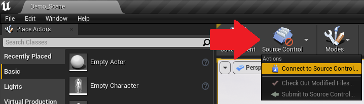

# Unreal Engine XR Content Guide

<!-- 
<iframe src="https://player.vimeo.com/video/534588250?h=7edf94bba3&amp;badge=0&amp;autopause=0&amp;player_id=0&amp;app_id=58479" frameborder="0" allow="autoplay; fullscreen; picture-in-picture" allowfullscreen style="position:absolute;top:0;left:0;width:100%;height:100%;" title="XR Studios | External Unreal Content Integration Guide"></iframe>
 -->

<!-- TODO record new video? -->

!> Only continue on once you've pulled the XR Studios Unreal Engine Template from Perforce - look at [this guide](docs/content/perforce.md) for more information if you don't have that yet.

This page contains information about how to get your Unreal Engine scene working correctly with our stage. We use **Disguise RenderStream**, which is an UE plugin, to interface UE4/5 to our stage.

## 🏃Quick Start

This is a short overview of the steps to prepare Unreal content for delivery, intended as a quick reference for those who are already familiar with the XR Studios workflow. For a more in-depth guide on XRS Unreal Content for first-time creators, see the rest of the sections below

- If transferring content from a different Unreal project, be sure to follow the folder hierarchy found in the template file. An overview of this file can be found [below](docs/content/unreal.md#project-file-overview).
- Import the "XRCameras" and "StageA_References" levels found in the "Stage" folder to your current scene. The XR Cameras are what Disguise uses to interface with the current scene and are ESSENTIAL. The stage reference is to help with placement of shots and the height of the floor which must be at 0,0,0. Anywhere talent is intended to walk on should be level with the stage floor.
  - Use the StageA_References assets for Previs. Do **not** modify the CineCam actors in the XRCameras levels.
- Add any objects that should occlude talent to a frontplate layer in the scene named "FG" (Select desired actors in World Outliner → Layers → Add Selected Actors to New Layer). Ensure the Actor Layer is named `FG`.
  - Note that objects in the frontplate layer cannot receive lighting from any other layers. Ensure the frontplate layer has lights in it. Alternatively, it might be helpful to build any frontplate objects as Actor Blueprints so that all Lighting and Meshes exist in the same Actor Blueprint container.
- Expose any control variables to the d3 timeline for real-time control by following the "Exposed Parameters" section of [this guide](http://help.disguise.one/Content/Configuring/Render-engines/RenderStream-Unreal.htm)

## 📋Perforce in Unreal Engine

### Connecting to Perforce

With P4V open and connected to the XR Studios Perforce server, launch the Unreal project from your workspace directory. You can find this by right-clicking on your file in the Workspace window, then going to _"Show In" → "Show In Explorer"_, which will open a window to the folder. You can also double-click the **.uproject** file in the Workspace window (below):

Once the project is open, select the source control option in Unreal and click _"Connect to source control"_. This option is located in different places depending on whether you are working in UE4 or UE5:

#### UE4 Location

In UE4, the icon is in the top left corner, next to the "Save Current" icon.

#### UE5 Location

In UE5, the icon is in the bottom right corner.

In the dialog box that appears, select Perforce as your provider, then sign in using the same credentials that you are using for P4V:

- **Server:** This should always be _ssl:perforce.xrstudios.live:1666_
- **User:** This should be the username provided to you by XR Studios, typically along the lines of _{project-name}-collab-user-{number}_ (for example, _cheese-collab-user-1_). If only one user was provided, there won't be a number after the _collab-user_ part of the username.
- **Workspace:** This is the name of the workspace you created for your project. If you fill in the server and user, you should be able to select your current workspace from the available workspaces tab (P4V must be running and connected to the server).

Click _"Accept Settings"_, and your UE project should now be connected to Perforce source control.

### Overview of Perforce in Unreal Engine

> 🚧Under construction!🚧

## 📁Project File Overview

All of the content will go inside the project's **Content** folder. The Content folder should be set up and interacted with as such:

- Folders marked in green mean you will be interacting with them.
- Folders marked in gray means it is highly unlikely that you will need to interact with them.
- White folders contain content that might be helpful to you depending on the needs of your project.
  - EditorMeshes contains a ColorCalibrator Cube.
  - MigratedBlueprints contains some potentially helpful tools migrated over from our UE4 Template.
  - OCIO contains an example OCIO config, and this is where you would also place any other configs or LUTs you may choose to use.
  - UltraDynamicSky contains the updated UE5.1 version of UltraDynamicSky

The main two folders you will be interacting with are:

- **Scenes**: This folder contains sub-folders for each separate scene in the project. Each scene should contain an Unreal Engine _Level (or map)_ and possibly a _Sequence_, if it's relevant to your design.
  - _Scene Level_: A named level _(.umap)_ that should contain all the visual content for its scene
  - _Scene Sequence_: A file _(.uasset)_ that contains the animation and sequencing for its scene
    - This can be added by opening the Level in Unreal Engine, clicking "Cinematics" on the overhead bar, and clicking "Add Level Sequence"
  - _Scene Assets_: For organization, we recommend keeping all relevant assets (files, folders, etc.) for a scene in the scene folder that it's used in.

?> Each scene should have its own named folder. The structure should look like: 📁Content &nbsp;&nbsp;&nbsp;&nbsp;📁Scenes &nbsp;&nbsp;&nbsp;&nbsp;&nbsp;&nbsp;&nbsp;&nbsp;📁Scene A &nbsp;&nbsp;&nbsp;&nbsp;&nbsp;&nbsp;&nbsp;&nbsp;&nbsp;&nbsp;&nbsp;&nbsp;🗺️Scene A Level (.umap) &nbsp;&nbsp;&nbsp;&nbsp;&nbsp;&nbsp;&nbsp;&nbsp;&nbsp;&nbsp;&nbsp;&nbsp;🎞️Scene A Sequence (.uasset) &nbsp;&nbsp;&nbsp;&nbsp;&nbsp;&nbsp;&nbsp;&nbsp;&nbsp;&nbsp;&nbsp;&nbsp;⚒️Other Scene A Folders and Files... &nbsp;&nbsp;&nbsp;&nbsp;&nbsp;&nbsp;&nbsp;&nbsp;📁Scene B &nbsp;&nbsp;&nbsp;&nbsp;&nbsp;&nbsp;&nbsp;&nbsp;&nbsp;&nbsp;&nbsp;&nbsp;🗺️Scene B Level (.umap) &nbsp;&nbsp;&nbsp;&nbsp;&nbsp;&nbsp;&nbsp;&nbsp;&nbsp;&nbsp;&nbsp;&nbsp;🎞️Scene B Sequence (.uasset) &nbsp;&nbsp;&nbsp;&nbsp;&nbsp;&nbsp;&nbsp;&nbsp;&nbsp;&nbsp;&nbsp;&nbsp;⚒️Other Scene B Folders and Files... &nbsp;&nbsp;&nbsp;&nbsp;&nbsp;&nbsp;&nbsp;&nbsp;📁Etc...

- **Stage**: This folder contains all the technical assets related to the physical stage like LED Reference Geometry, XRCameras, and Example Tutorials. You should not need to modify anything in here.
  - **Main Level**: A level that contains reference objects to the Stage and the Cameras. Additionally, there are examples of different common XR content types and disguise integrations.
  - **Stage A References**: Meshes and 3D Objects exactly matching the XR Studios Stage A to help visualize the content's relationship to the real world.
  - **XR Cameras**: A scene containing the cameras that will stream the content to the LED Stage. Add this as a sublevel to the content's level to gain access to the cameras.

## 📩Migrating Existing Content

If you have existing Unreal content you'd like to use, you can migrate it into the Template project.

1. Replicate the Folder Hierarchy in your existing Project: _Content → Scenes → \*SceneFolderName\* → [Scene Level & Scene Content Here]_
2. Migrate your Level: _Asset Actions → Migrate_. Choose the Content Folder of the Template Project as your destination.
3. Check that there were no errors! Continue to work inside the Template Project.

## 🛠️Creating Content with the Template

To ensure the XR project runs correctly on the stage, there are some guidelines and steps you'll need to follow. These are detailed below...

### Lighting

In general, try to limit the number of lights in the scene to only the essential ones. Make sure their brightnesses are set to acceptable levels; in other words, don't make the lights super bright then compensate via PPV exposure.

Additionally, try to avoid the following:

- Too many dynamic lights
- Too many shadow-casting lights
- Overlapping attenuation on lights

_Lumen_ also works well for indirect lighting, but can be computationally expensive in scenes with many dynamic objects or large open areas.

If possible, bake static lighting in your scene as well.

### Meshes

Performance with meshes is directly tied to the number of polygons; the more polygons in the scene, the more computationally expensive the scene is. For example, using a mesh with 10 million polygons -OR- using 10 million low-poly meshes will significantly slow down performance. To mitigate this, avoid putting meshes where the camera won't see, and assets that are computationally-friendly (i.e., not too many polygons).

For Unreal Engine 5, use _Nanite_ (UE5's virtualized geometry system) whenever possible. Please see [Epic's Documentation on Nanite](https://docs.unrealengine.com/5.1/en-US/nanite-virtualized-geometry-in-unreal-engine/#supportedfeaturesofnanite) if you are unsure of how to enable it or exceptions that may exist.

### Materials

> 🚧Under construction!🚧

### Post-Process Volumes

With post-process volumes, there are a number of options that are not suitable for use with RenderStream. Note that this can sometimes be mitigated with padding and overlap, but this must be evaluated on a case-by-case basis. These options include:

- Depth of Field
- Bloom
- Vignette
- Lens Flare
- Temporal Anti Aliasing (TAA)
- Screen Space Global Illumination (SSG)
- Screen Space Ambient Occlusion (SSAO)
- Screen Space Reflections (SSR)
- Raytracing (denoiser)
- Chromatic Aberrations
- Eye Adaption
- Motion Blur

Additionally, the Exposure within both the post-process volume and call cameras must be set to _Manual_, to ensure that the exposure of split frames isn't different (which causes a noticeable seam).

### Level Sequences

Some tips for level sequences:

- Ensure sequences are built at a time base consistent with the shoot (e.g. 23.976fps shoot = 23.976fps level sequence)
- All animation that needs to sync to timecode should be included in the sequencer
- Include 5 seconds (300frames) of pre-roll and post-roll to compensate for any delay

!> Do **not** use the cameras from the XRCameras sublevel in your sequences, or modify them in any way. The only interaction one should have with the XRCameras Sub-Level is adding it as a Sub-Level and/or setting the Sub-Level to "Always Loaded". Use the CineCameraActor0 in the StageA_References scene to previs or add your own.

### FBX Sequences

To import an FBX Sequence into your scene, navigate to `File > Import into Level`. The "Import" button in the Content Browser **_will not_** take you to the correct dialog

In the file menu popup, choose a location within the scene's folder for the imported sequence to reside. Once this is done, a dialogue with the FBX Scene Import Options should appear. Click Import.

Add an _FBX Scene_ object to the Level Sequence, then an _FBX Animation Sequence_ object to the Animation Track.

### Niagara Particle Systems

Niagara systems must be deterministic using a [System Life Cycle](https://www.youtube.com/watch?v=rIkpu358Hak&feature=emb_title) track on the Level Sequence's timeline.

### Media Tracks

Media can be added to a scene in the form of a 60fps EXR or PNG Image Sequence via a [Media Track](https://docs.unrealengine.com/4.27/en-US/WorkingWithMedia/IntegratingMedia/MediaFramework/HowTo/ImgMediaSource/) in the Level Sequence.

### Exposable Parameters

Exposable parameters are a useful feature that allow for quick tweaking onsite by our media server operators without having to go into the Unreal scene itself. With values exposed, we build in flexibility and can keyframe values directly from the server. Examples of this are positions of specific objects, lighting color or intensity, timing of animations, etc.

Only the following types of variables are currently supported as exposed parameters:

- Number (float, int, etc.)
- Text (NOT string)
- Image
- Pose
- Transform

To do this, go inside your level blueprint and create a variable based upon your needs. When a variable is selected, check Instance Editable, which allows access to the variable (you can see this with the "eye" icon opening in the _Variables_ section on the left-hand side). Additionally, inside of the specific variable, you can control the category selection and the default value which will be the starting point. Make sure you compile the blueprint upon completion of steps.

!> Currently, Disguise only supports Exposed Parameters that are triggered by Event Tick nodes inside Unreal level blueprints. These can be very resource-intensive, so it is recommended to choose them wisely and continuously check FPS and performance. Ensure all Exposed Parameters are being tracked in the Project Document spreadsheet (ask your XRS rep for this if you do not have it).

### Remote Texture Sharing

The RenderStream plugin offers support for the sharing of textures through the use of exposed parameters. This allows a two-way flow of video content between disguise and the Unreal Engine project.
Follow these steps to configure:

1. Add a 3D Object into the scene onto which the texture will be streamed
2. Create a new Render Target and Material:
    1. Create a new Asset under _Materials & Textures → Render Target_
    2. Drop the Render Target onto the 3D Object you created in Step 1
    3. Ensure that a new material has been created for the Render Target, and has been set as a material element in the "Materials" component of the 3D Object
3. Expose the Render Texture as an exposed parameter, following the steps in the section above
    - The Blueprint Variable created should be of type `Texture Render Target 2D`
    - The variable's Default Value should be the Render Target created in Step 2

### Fixed Plate Render (or Outer Frustum)

The **fixed plate render** is a video file rendered from a fixed camera position that is displayed on the LED outside of the camera frustrum to provide consistent ambient lighting when the camera frustrum does not cover the full LED surface. It acts as an Outer Frustum without needing to be rendered in real-time.

1. Place a camera in your level, and position it to capture most/all of the stage
2. Create a new Sequence in your scene via Cinematics → New Level Sequence
3. Drag the new camera from your World Outline into the Sequencer
4. Save the Sequence
5. Go to _Window → Cinematics → Movie Render Queue_, click to add a Render, and select your Sequence
6. The media you export depends on your scene:
    1. If your scene has lots of moving parts or interactivity, in the Job's settings, disable ".jpg Sequence" and add a new setting for "Apple ProRes". Set its codec to HQ. Accept settings.
    2. Otherwise, in the Job's settings, disable ".jpg Sequence" and add a new setting for ".png Sequence". In the Output settings, check "Use Custom Playback Range", and set "Custom End Frame" to 1. Accept settings.
7. Press "Render (Remote)". The static plate .mov or .png will be in the folder specified in your Job's Output settings.
8. If you exported a video, using the [NotchLC plugin](https://notchlc.notch.one/), convert your rendered video to a NotchLC optimal codec .mov file.

## ⚙️Optimizing Performance

- Scenes MUST run at or above 60fps on Disguise RX2 Hardware
- As a general rule, keep your project's Game Time under 8ms, and its Total Frame Time under 16ms. Lower is always better!

Be aware of building and developing optimized content. There are a number of areas in your scene that may be reducing performance. Utilize profiling and debug tools to find good candidates for optimization. Common areas include:

- Lighting:
  - Too many dynamic lights
  - Too many shadow-casting lights
  - Overlapping attenuation on lights
- Materials:
  - High texture memory use
  - High number of unique materials
  - Too many shader instructions
  - Many transparent overlapping materials (overdraw)
- Objects
  - Large number of objects / high triangle count
  - Complex CPU logic (collisions, water, etc)
  - Lots of blueprint logic happening every frame (i.e. using Event Tick)

Optimization is a complex subject influenced by multiple variables such as (but not limited to):

- Mobility status for mesh actors and lighting actors
- Render settings
- Complexity of Materials
- Amount of Materials vs. Material Instances used
- Complexity of meshes (and for UE5 - whether they are Nanite meshes or not)
- Complexity of lighting actors / how many lighting actors are in the scene

The above list and subsequent notes are not intended to be a comprehensive overview, but a starting point when optimizing and delivering real-time scenes to XRS. The below are helpful tips we have encountered.

### Other Guidelines

- If we won't see it, don't bother rendering it.
  - This general rule of thumb has been made easier with the introduction of Nanite in UE5, which replaces the LOD system from UE4 (unless using Fallback Mesh LODs).
  - Nanite optimization works for geometry but is not applicable to textures. Don't use very high resolution textures on far away objects.
  - Make sure all textures in use have resolutions that are in power of 2; Unreal will automatically create MipMaps if this is the case.
  - Turn off shadows under individual light actors when they're not needed.
- For UE5, use Nanite whenever possible. Please see [Epic's Documentation on Nanite](https://docs.unrealengine.com/5.1/en-US/nanite-virtualized-geometry-in-unreal-engine/#supportedfeaturesofnanite) if you are unsure of how to enable it or exceptions that may exist.
- Step through all Viewmodes for any glaring issues. The Viewmodes most relevant to optimization include:
  - Light Complexity
  - Lightmap Density
  - Stationary Light Overlap
  - Shader Complexity
  - Shader Complexity & Quads
  - Quad Overdraw
  - Nanite Visualization
  - Lumen Visualization
- Use [Unreal Insights](https://docs.unrealengine.com/5.1/en-US/unreal-insights-in-unreal-engine/) to diagnose issues
- Monitor your FPS while building the scene and sequences.

Disguise's RenderStream plugin contains a feature known as the [RenderStream Validation Framework](https://help.disguise.one/en/Content/Configuring/RenderStream/RenderStream-1-30.htm?Highlight=renderstream%20validation%20framework). This feature is automatically enabled and will alert you via the Message Log of any settings that might be problematic for RenderStream.

<!--
## 📝Handoff Checklist

 - Ensure there is a [Player Start Actor](https://docs.unrealengine.com/4.26/en-US/Basics/Actors/PlayerStart/) somewhere not-visible in the scene (like under the floor); this prevents the default Player Sphere from spawning on Play. 

- [X] MEOW

- Disable any mannequins
- Make sure Frame Smoothing is disabled: Go to `Edit > Project Settings > Engine > General Settings > Framerate` and ensure that `Smooth Framerate` is unchecked.
- Ensure Blueprint nodes are only firing on Event Tick IF it is absolutely necessary that they run every frame. Use timers, timelines, custom tick intervals, or custom events in lieu of Event Tick wherever possible.
- Avoid expensive functions (Get All Actors of Class, for loops, complex construction scripts, etc) especially in Blueprints that run more than once.
- Painlessly package your project by including any necessary plugins in the Plugin folder of the PROJECT folder structure, as opposed to them being installed to the ENGINE folder structure.
- TODO: FP / BP, etc.
-->

## 📚Other Resources and Videos

If you'd like some further information on working with Perforce

- [RenderStream and Unreal Engine](https://help.disguise.one/en/Content/Configuring/Render-engines/Unreal/RS-UE-overview.htm)
- [How To Use Perforce Helix Core + Unreal Engine 5](https://www.perforce.com/blog/vcs/how-use-unreal-engine-5-perforce)
- [Perforce U: Merging and Collaborating with Unreal Engine](https://perforceu.perforce.com/vp/merging-collaborating-unreal-engine)
