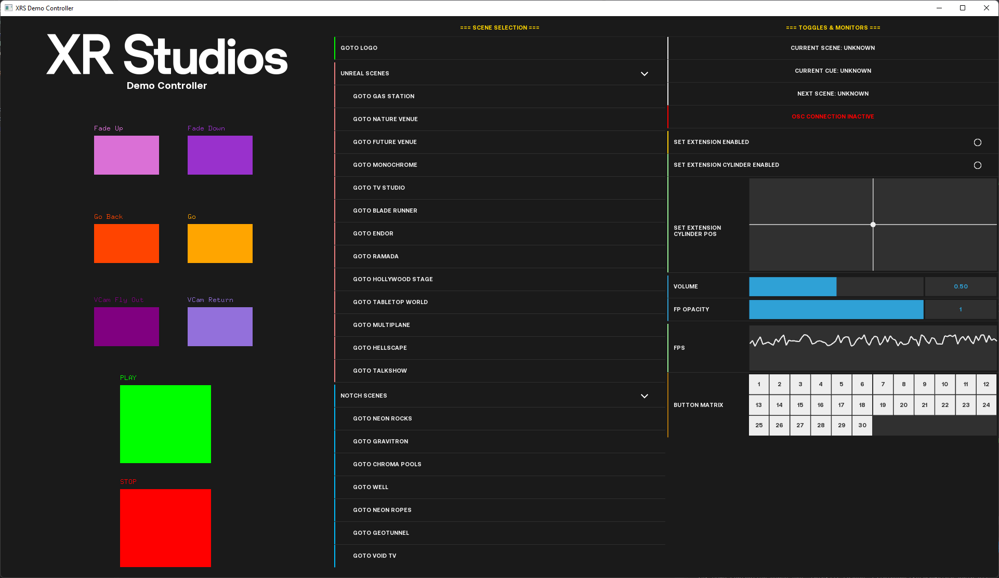

# Getting Started
## About
ofxXRS is a library for creating consistent UIs for any proprietary software or application developed by XR Studios. It looks like this:  
<div align=justify>

</div>

ofxXRS is an addon for [openFrameworks](https://openframeworks.cc/), a C++ toolkit for easy creation and rendering of applications.

In its current state it is essentially an addon package more than an addon in its own right, it combines the following openFrameworks addons into one, with slight modifications to make them include our branding assets and play nice with one another:
- [ofxDatGui](https://braitsch.github.io/ofxDatGui/) by braitsch
- [ofxSimpleButton](https://github.com/azuremous/ofxSimpleButton) by azuremous
- [ofxGuiExtended](https://github.com/frauzufall/ofxGuiExtended) by frauzufall

<p>&nbsp;</p>

# Setup
1. Download and setup [openFrameworks](https://openframeworks.cc/download/)
2. Download the openFrameworks addon as a .zip from its [GitHub Repo](https://github.com/XR-Studios/ofxXRS)
3. Extract the repo to your `openFrameworks/addons/` folder, removing "-master" from the folder name (the folder should just read *ofxXRS* similar to all the other addons in that folder)
4. Run the **projectGenerator** and create a project. Make sure *ofxXRS* is included in the **addons** section. If *ofxXRS* does not appear as an option you did something wrong in steps 2-3. Check out openFrameworks' [guide for installing addons](https://openframeworks.cc/learning/01_basics/how_to_add_addon_to_project/) if you need help.
5. Navigate to your `openFrameworks/addons/ofxXRS/` folder.
6. Copy the **ofxXRS_img** folder itself into your project's data folder: `openFrameworks/apps/myApps/(projectName)/bin/data`
7. Open your generated project.
8. In your *ofApp.h*, `#include "ofxXRS.h"`
9. You now have access to the ofxXRS library!

<p>&nbsp;</p>

# My First XRS App
Once you have successfully generated a project with the ofxXRS addon included, you can start making your UI right away.

The quickest way to get a functional and nice-looking UI is via [Panels](components.md#Panel).  
Add a member variable to your app's header file to hold the panel, then in your app's *setup()* method, instantiate the panel and add components to it:

```cpp
/**
* ofApp.h
**/

#include "ofxXRS.h"

ofxXRSPanel* panel;


/**
 * ofApp.cpp
 **/

void ofApp::setup() {
    panel = new ofxXRSPanel(ofxXRSPanelAnchor::TOP_LEFT);
    panel->addLabel("Label");
    panel->addButton("Button");
    panel->addToggle("Toggle");
    panel->addSlider("Slider", 0.0f, 1.0f, 0.5f);
    panel->add2dPad("2D Pad");

    // By default, the UI panels are a bit small, in case our application
    // is also rendering something in its window that is being interacted with
    // by our UI panel. Let's resize it since, in our example case, the UI
    // will be the entirety of the application. See the "Themes" section
    // of the documentation for more details about what's going on here.
    ofxXRSTheme* theme = new ofxXRSTheme(false);
    theme->resize(1.75);
    theme->init();
    panel->setTheme(theme);
}
```
Note that by default, all UI elements in ofxXRS auto-draw, and thus nothing needs to be done with your components in the *draw()* method.

Run your app, and ta-da! A nice fancy UI in the corner. However, the UI as it currently exists is just graphics. Let's add some event listeners to hook it up.

In our application's header file, add methods to handle all our events, and implement them in our *ofApp.cpp* :
```cpp
/**
 * ofApp.h
 **/

void onButtonEvent(ofxXRSButtonEvent e);
void onToggleEvent(ofxXRSToggleEvent e);
void onSliderEvent(ofxXRSSliderEvent e);
void on2dPadEvent(ofxXRS2dPadEvent e);


/**
 * ofApp.cpp
 **/

void ofApp::onButtonEvent(ofxXRSButtonEvent e) {
    std::cout << "onButtonEvent from component: " << e.target->getLabel() << std::endl; 
}

void ofApp::onToggleEvent(ofxXRSToggleEvent e) {
    std::cout << "onToggleEvent from component: " << e.target->getLabel() << std::endl; 
    std::cout << "onToggleEvent state set to: " << e.target->getChecked() << std::endl;
}

void ofApp::onSliderEvent(ofxXRSSliderEvent e) {
    std::cout << "onSliderEvent from component: " << e.target->getLabel() << std::endl;
    std::cout << "onSliderEvent value: " << e.value << std::endl;
}

void ofApp::on2dPadEvent(ofxXRS2dPadEvent e) {
    std::cout << "on2dPadEvent from component: " << e.target->getLabel() << std::endl; 
    std::cout << "on2dPadEvent Coords: (" << e.x << ", " << e.y << ")" << std::endl;
}

void ofApp::setup() {
    panel->onButtonEvent(this, &ofApp::onButtonEvent);
    panel->onToggleEvent(this, &ofApp::onToggleEvent);
    panel->onSliderEvent(this, &ofApp::onSliderEvent);
    panel->on2dPadEvent(this, &ofApp::on2dPadEvent);
}
```
You now have functional controls with your Panel UI!  
Last but not least, let's add some of the non-panel components to familiarize ourselves with them.
They need their own event listeners because they don't pass any of the *ofxXRSEvent* objects, so they aren't compatible
with the onButtonEvent(), etc that we just declared and implemented for our panel's components.

```cpp
/**
* ofApp.h
**/

ofxXRSSimpleButton rectangle, circle, img;
void rectClicked();
void circleClicked();
void imgClicked();


/**
* ofApp.cpp
**/

void ofApp::setup() {
    rectangle.setup(10, 10, 100, 100, true, false, ofxXRSSimpleButton::TYPE_BUTTON, ofxXRSSimpleButton::BUTTON_RECT, ofColor::green);
    rectangle.setName("Large Rectangular Button");
    ofAddListener(rectangle.mousePressedEvent, this, &ofApp::rectClicked);

    circle.setup(10, 120, 100, 100, true, false, ofxXRSSimpleButton::TYPE_BUTTON, ofxXRSSimpleButton::BUTTON_RECT, ofColor::red);
    circle.setName("Large Circular Button");
    ofAddListener(circle.mousePressedEvent, this, &ofApp::rectClicked);

    img.setup(10, 240, "path/to/img.png");
    img.setName("Large Image Button");
    ofAddListener(img.mousePressedEvent, this, &ofApp::imgClicked);
}

void ofApp::rectClicked() {
    std::cout << "Rectangular Button Clicked!" << std::endl;
}

void ofApp::circleClicked() {
    std::cout << "Circular Button Clicked!" << std::endl;
}

void ofApp::imgClicked() {
    std::cout << "Image Button Clicked!" << std::endl;
}

```
<p>&nbsp;</p>

# Gotchas
 - I installed the addon properly, but when I run my app, it says it can't find a .png or .ttf file and halts!
    - You have improperly set up the folder path to the fonts and images for the UI, which is hardcoded. The folder structure should be as follows for your application's library to properly locate its resources:  
    `(openFrameworks apps location)/(projectName)/bin/data/ofxXRS_img/`  
    with the **fonts** and **icons** folders therein.  
    
    Alternatively, you could go into  
    `openFrameworks/addons/ofxXRS/src/themes/ofxXRSTheme.h`  
    and change the path where the resources are loaded, though it will always have to be somewhere in `/bin/data` per openFrameworks' resource importing system.
<p>&nbsp;</p>
- I get a linker or SDK error when trying to build my project in Visual Studio!
    - Are you using Visual Studio 2019? Each openFrameworks release is written for a specific version of Microsoft's C++ SDK. Currently openFrameworks only works with Visual Studio 2017 using the Visual Studio 2017 Build Tools.
<p>&nbsp;</p>
- It sucks that panel components and non-panel components like Large Buttons aren't aware of one another at all! They shouldn't need separate event listeners!
    - I'm working on it!!!
<p>&nbsp;</p>
- How do I know when to use `->` versus `.` when referencing an object?
    - You do not know C++ well enough to effectively develop native applications. Ask Jeremy for the CodeAcademy login and take some classes.