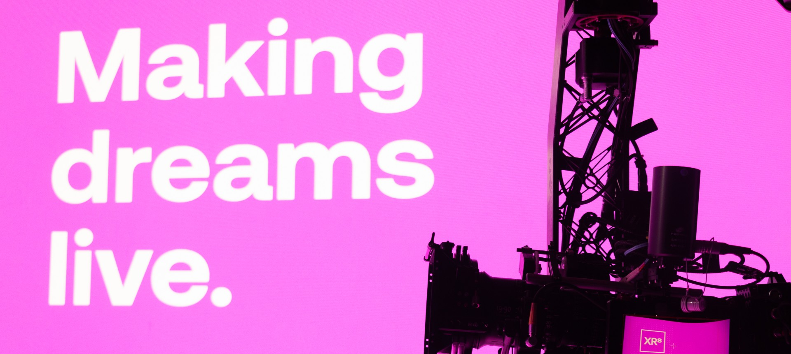

# XR Studios - Content Integration Portal <!-- {docsify-ignore-all} -->

<!--  -->

Welcome to the XR Studios Content Integration Portal! This site serves as a hub for all public resources and guides for working with XR Studios, including studio information and content delivery.

## XR Stages and Studio Info

The [Studio](docs/studios/hollywood/studioInfo.md) tab contains information about our physical studio location, including:

-   Address
-   Equipment
-   Stage layouts

## Template Files

<a href="https://xr-studios.github.io/#/docs/content/templates"><button type="button">Template Files for each supported software</button></a>

## Content Guidelines & Resources

Are you preparing for a shoot with XRS and need to prepare your content?  
First get set up to send and receive content by following the [Content Delivery via Perforce](docs/content/perforce.md) guide,  
then refer to either the [Unreal](docs/content/unreal.md) or [Notch](docs/content/notch.md) XR Content Guides below for specific workflows and resources.

